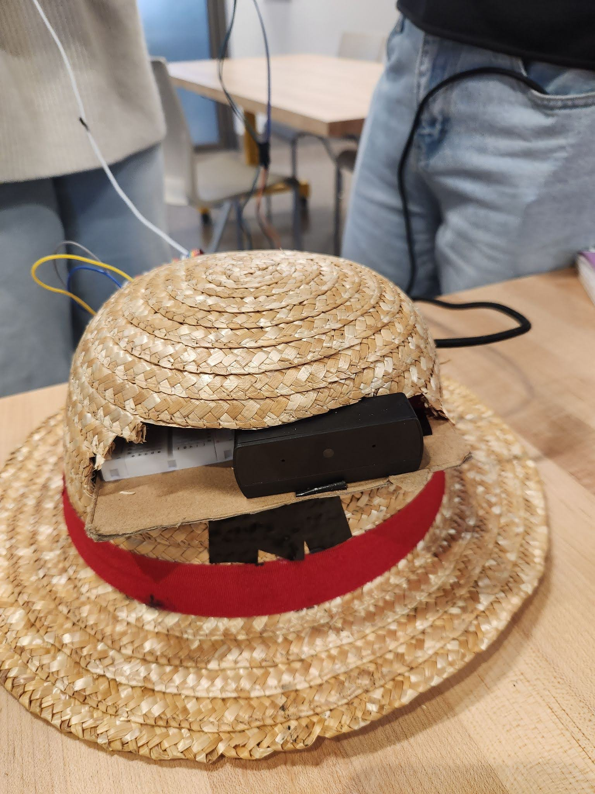

# Assistive Navigation Device for the Visually Impaired

🚀 Built a wearable AI-powered navigation device to help visually impaired users navigate safely using real-time computer vision, audio, and haptic feedback.

---

## Overview
This project is a wearable system that captures images of the user's surroundings and uses artificial intelligence to describe them in real time. The output is delivered through audio and vibration feedback, allowing visually impaired users to better understand and navigate their environment.

---

## Demo
▶️ YouTube Demo: https://www.youtube.com/watch?v=k_EpGdcFMfQ
📷 Device images in:  /media

---

## Problem Statement
Visually impaired individuals often face challenges such as identifying objects, reading labels, and navigating unfamiliar spaces. Many existing solutions are expensive, slow, or overly complex. This project aims to provide an affordable, portable, and easy-to-use alternative.

---

## Solution
The device consists of a camera mounted on a wearable hat, a wristband button for input, and speaker/vibration outputs.

When the button is pressed:
1. The camera captures an image.
2. The image is sent to the OpenAI API for analysis.
3. The response is converted into text.
4. The text is converted into speech.
5. Audio and haptic feedback are delivered to the user.

---

## Prototype

Physical wearable prototype integrating camera, button, speaker, and vibration motor.

---

## Technology Stack
- Python
- Raspberry Pi OS (Linux)
- OpenAI Vision API (REST)
- Camera Module
- Text-to-Speech (pyttsx3 / gTTS)
- Speaker & Vibration Motor

---

## Features
- One-button operation
- Real-time AI image analysis
- Audio and vibration feedback
- Wearable and portable design
- Modular software architecture

---

## Project Development Process
1. User research and ideation
2. Product research and concept design
3. Hardware implementation
4. Software development
5. Prototyping and assembly
6. User testing and iteration

---

## My Role
- Designed and implemented core Python application logic
- Integrated OpenAI Vision API and response parsing
- Developed image processing and request pipeline
- Assisted with hardware integration and calibration
- Led debugging and performance testing

---

## Results and Future Work
- Successfully tested with multiple users
- Improved stability and comfort based on feedback
- Planned improvements include Bluetooth audio support and adjustable camera positioning

---

## What I Learned
- Designing hardware-software systems
- Working with REST APIs and real-time data
- Debugging embedded systems
- User-centered accessibility design
- Managing team-based engineering projects

---

## Documentation
Design drafts, development proposals, and presentation materials are available in the /docs folder.

--- 

## Setup Instructions
1. Clone the repository  
2. Install dependencies: pip install -r requirements.txt  
3. Configure OpenAI API key in environment variables  
4. Connect camera and hardware components  
5. Run: python src/main.py

Detailed setup instructions are available in the docs folder.
